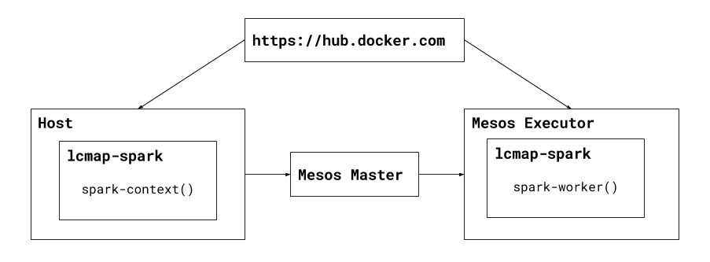
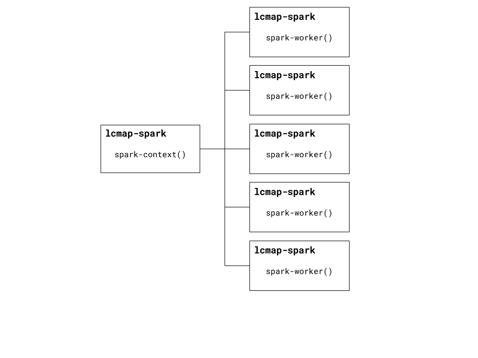

Configuration
=============

Parameters
----------
lcmap-spark configuration parameters are passed differently for ``pyspark``, ``spark-submit`` or ``jupyter notebook``.

``pyspark`` and ``spark-submit`` are executables inside lcmap-spark that implicitly create a SparkContext.

Parameters are passed to these executables in the same manner as non-Docker based installations.

See https://spark.apache.org/docs/latest/submitting-applications.html.

``jupyter notebook`` is a general server process that does not implicitly create a SparkContext.

In this case, it is best to pass parameters through the environment with ``docker run -e key=value`` so they may be parsed in notebook code with ``os.environ``.

Volumes
-------

There are several cases where host files are needed on the Docker filesystem.

* Mesos certificates in cluster mode
* Job files
* Jupyter Notebooks

Volumes may be mounted using the ``-v /path/to/host/dir:/path/to/docker/dir`` flag.

* Full paths must be specified
* Set ``-u`` to the host system user's UID so file permissions match

.. code-block:: bash

   docker run -u `id -u` \
              -v /path/to/host/dir:/path/to/docker/dir \
              <other flags> \
              usgseros/lcmap-spark:1.0 \
              <command>

Network
-------

Docker has extensive networking capablities.

lcmap-spark's use of these capabilities is minimal.

In order to properly overlay a dynamic Spark cluster on top of Mesos, only ``--net host`` should ever be used.

This eases host system access to Jupyter Notebooks in local or cluster mode as well.

Notebooks
---------

lcmap-spark's Jupyter Notebook server expects it's notebook directory to be at ``/home/lcmap/notebook`` by default.

Mount a volume from the host filesystem to this location when running the notebook server.

.. code-block:: bash

   docker run -u `id -u` \
              -v /your/notebooks:/home/lcmap/notebook \
              <other flags>
              usgseros/lcmap-spark:1.0 \
              jupyter --ip=$HOSTNAME notebook

Local Mode
----------
The only requirement for running lcmap-spark in local mode is the ability to start a Docker container.

The Docker image must be built on the host machine but does not need to be published to https://hub.docker.com.

Cluster Mode
------------

https://spark.apache.org/docs/latest/cluster-overview.html

Cluster mode uses Apache Mesos as a cluster manager, allowing Spark to run functions in parallel across many physical hosts.

Cluster mode requirements are:

* Ability to run lcmap-spark locally
* Docker image published to https://hub.docker.com
* Network access to Mesos Master(s), ideally over a 10 Gigabit or greater link
* Mesos username
* Mesos role
* Mesos password
* Mesos certificates

When run in cluster mode, the lcmap-spark image is automatically downloaded onto Mesos nodes and used to create Docker containers, which dynamically create the Spark cluster and execute application code.

1. lcmap-spark is downloaded & started on the host from https://hub.docker.com
2. A SparkContext() is created, which requests resources from the Mesos Master
3. The Mesos Master schedules the Mesos job on one or more Mesos Executors
4. The Mesos Executors download lcmap-spark and execute a Spark Worker
5. The Spark Worker contacts the SparkContext
6. A Spark Cluster now exists.

After a Spark cluster is started using Mesos, it behaves as any Spark cluster would if started manually.

The SparkContext maintains it's reservation on resources with the Mesos Master, keeping the cluster alive.

Once ``.stop()`` is called on the SparkContext, it releases it's resource reservation and the Spark cluster is shut down.      

Running Spark on Mesos in Docker provides a reliable way to dynamically create a consistent, immutable execution environment across a cluster of machines.

Apache Mesos
------------
https://spark.apache.org/docs/latest/running-on-mesos.html

When running on Mesos, there are two modes that determine where the SparkContext runs: client and cluster.

lcmap-spark uses client mode only: The driver program (SparkContext) will always run on the local client machine.

**This shouldn't be confused with Spark's local and cluster modes, which determine where the Spark Workers run.**

SSL Based Authentication
~~~~~~~~~~~~~~~~~~~~~~~~~~~~~~~~~~~
Three files must be present in the image ``/certs`` directory to enable authentication over SSL.

They may be obtained from Mesos admins.

* mesos.crt
* mesos.key
* trustedroot.crt

These files should never be published in an image, as this constitues a security violation.

Mount them as a volume at runtime instead:

.. code-block:: bash

    docker run <flags> -v /home/user/certs:/certs usgseros/lcmap-spark <command>

